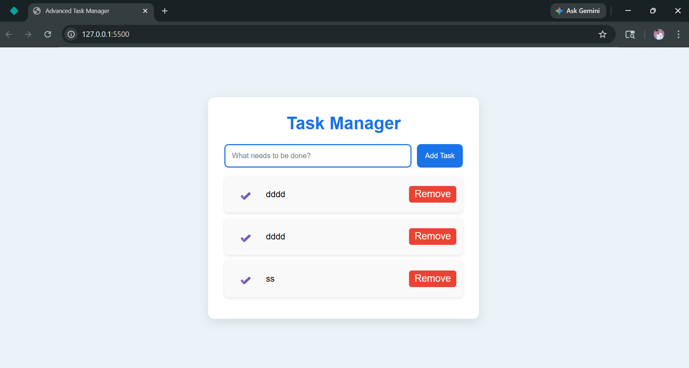

# 📝 Task Manager App

A clean and user-friendly **Task Manager Web Application** built using **HTML, CSS, and JavaScript**. This application helps users efficiently manage their daily tasks with essential features like adding, editing, deleting, and marking tasks as completed.

---

## 🌐 Live Demo

🔗 https://magesh-task-manager.netlify.app/

---

## 📂 GitHub Repository

🔗 https://github.com/magesh-frontend/task-manager-app

---

## 📸 Screenshot



---

## ✨ Features

* ✅ Add new tasks
* ✏️ Edit tasks (Double click to edit)
* 🗑️ Delete tasks
* ✔️ Mark tasks as completed
* 💾 Persistent storage using LocalStorage
* ⌨️ Add tasks using Enter key
* 🎨 Clean and responsive UI

---

## 🛠️ Technologies Used

* HTML5
* CSS3
* JavaScript (Vanilla JS)
* LocalStorage API

---

## 📁 Project Structure

```
task-manager-app/
│── index.html
│── style.css
│── script.js
│── screenshot.png
```

---

## ⚙️ How to Run Locally

1. Clone the repository:

   ```
   git clone https://github.com/magesh-frontend/task-manager-app.git
   ```

2. Open the project folder

3. Open `index.html` in your browser

---

---

## 👨‍💻 Author

**Magesh Balu**

---


If you like this project, give it a ⭐ on GitHub!

---
